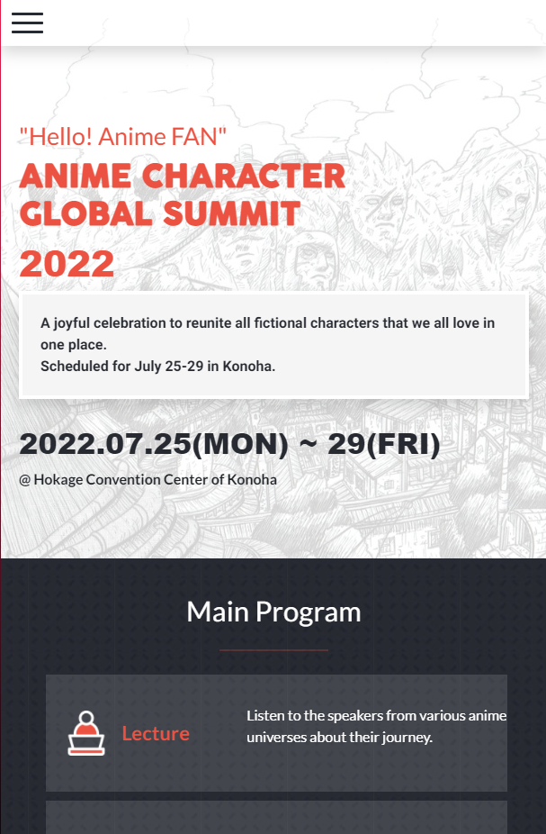
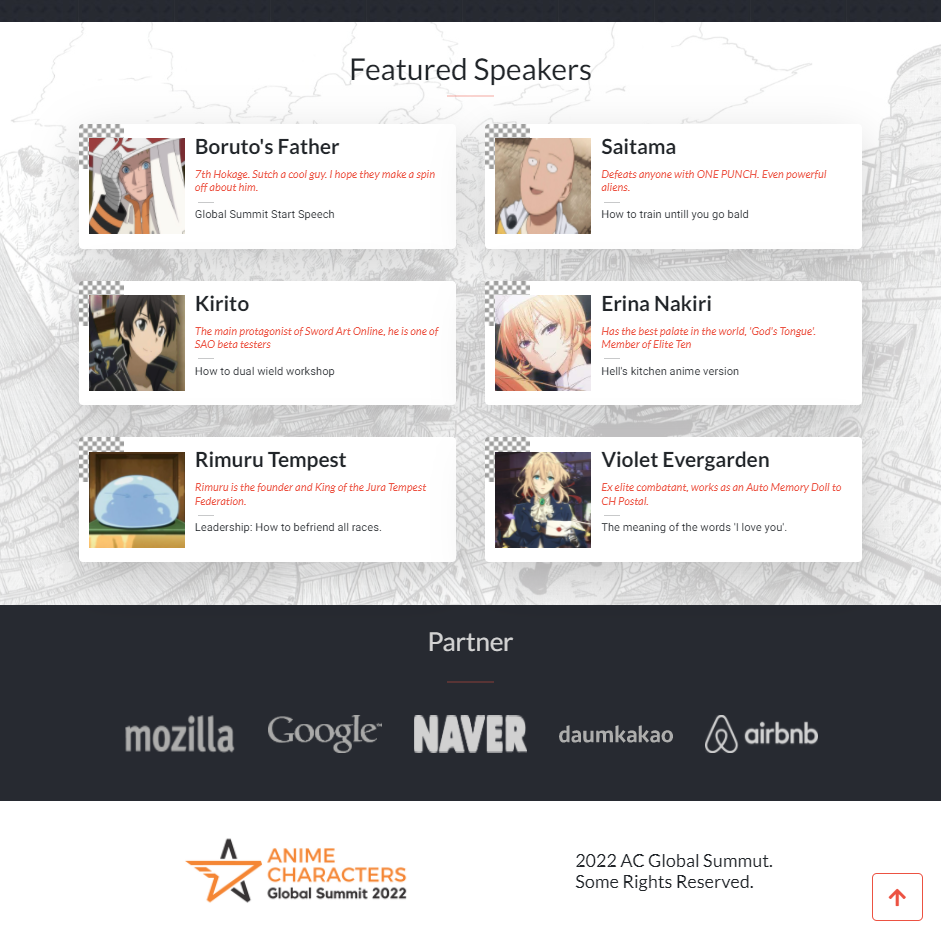

# Microverse Module 1 Capstone

> In this capstone project I've built a website for a conference. Microverse provided some [design guidelines](https://www.behance.net/gallery/29845175/CC-Global-Summit-2015) for me to create the website, but I've personalized the content. 

  

  

## Built With

- HTML 5
- CSS 3
- Javascript
- Bootstrap

## Live Demo

[Live Demo Link](franciscoponcedev.github.io/capstone1/)

### Project requirements

- Personalize the content of your page. Choose a topic that is different than the one in the original design.
- Follow these [design guidelines](https://www.behance.net/gallery/29845175/CC-Global-Summit-2015), including:
  - Colors.
  - Typography: font face, size and weight.
  - Layout: composition and space between elements.
- The pages should look almost identical to the original design. Small adjustments like text or image changes are acceptable.
- You can use Bootstrap for styling, if you want to.
- You should build only these 2 pages:
  - The *home page*.
  - The *about page*.
- Each of these pages should have versions for 2 different screen sizes: 
  - Mobile: up to 768px wide.
  - Desktop: 768px or wider.

- Interactions
  - Links
    - The *home page* should have a link in the menu to the *about page*.
    - The logo in the header links to the *home page*.
  - Mobile menu
    - When the user clicks (or taps) the hamburger button on the header, the mobile menu appears over the page.
    - There are no guidelines for the mobile menu in the docs, but you should implement it so it is consistent with the design (colors, typography, spacings, etc.).
    - The mobile menu should have a close (X) button that closes the menu.
- Dynamic page
  - The section "Featured speakers" should be created dynamically in JavaScript.
  - You should use a JavaScript variable with the data about the speakers and use it when the page loads to create the HTML for this section dynamically.

## How to run in your local machine

- Copy the URL: "git@github.com:franciscoPonceDev/Capstone1.git"
- In your terminal, go to the directory you want to clone the repository.
- Use the command: git clone git@github.com:franciscoPonceDev/Capstone1.git
- Open index.html file

## Authors

👤 **Author1**

- GitHub: [@franciscoPonceDev](https://github.com/franciscoPonceDev)
- LinkedIn: [LinkedIn](https://www.linkedin.com/in/dev-ponce/)

## Show your support

Give a ⭐️ if you like this project!

## Acknowledgments

- Original design idea by [Cindy Shin in Behance](https://www.behance.net/adagio07).
